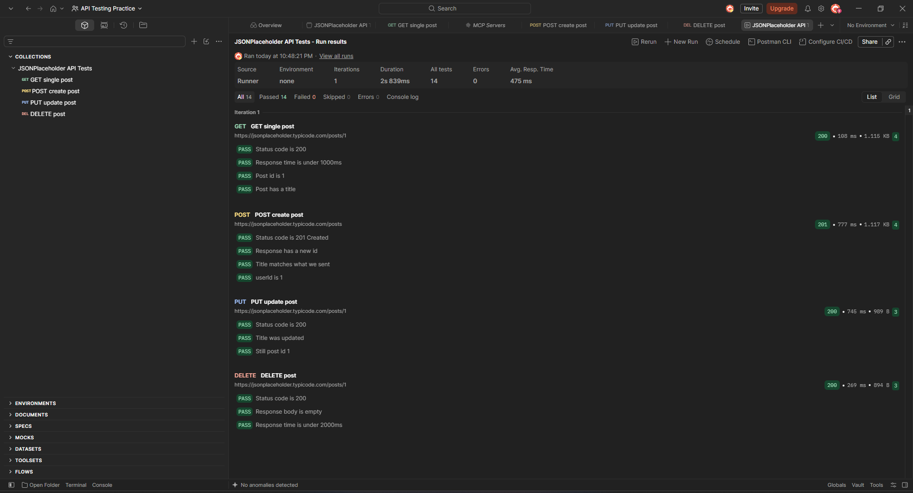

# Postman API Testing – JSONPlaceholder

API test collection built in Postman to validate CRUD operations against the [JSONPlaceholder](https://jsonplaceholder.typicode.com) REST API.

## Test Results

**14 tests passed, 0 failed** (Postman Collection Runner)

## Test Coverage

| # | Method | Endpoint | Tests | What is checked |
|---|--------|----------|-------|-----------------|
| 1 | GET | `/posts/1` | 4 | Status 200, response time < 1000ms, correct id, title exists |
| 2 | POST | `/posts` | 4 | Status 201 Created, new id returned, title and userId match request body |
| 3 | PUT | `/posts/1` | 3 | Status 200, title updated, id unchanged |
| 4 | DELETE | `/posts/1` | 3 | Status 200, empty response body, response time < 2000ms |

## Tools

- Postman (requests, JavaScript test scripts, Collection Runner)
- JavaScript (`pm.test`, `pm.expect` assertions)
- JSON request bodies

## How to Run

1. Download `jsonplaceholder-api-tests.postman_collection.json`
2. In Postman, click **Import** and select the file
3. Right-click the collection and choose **Run**, then click **Start run**

## Skills Demonstrated

- REST API testing (GET, POST, PUT, DELETE)
- Status code and response body validation
- Response time checks
- Writing automated test assertions in JavaScript
